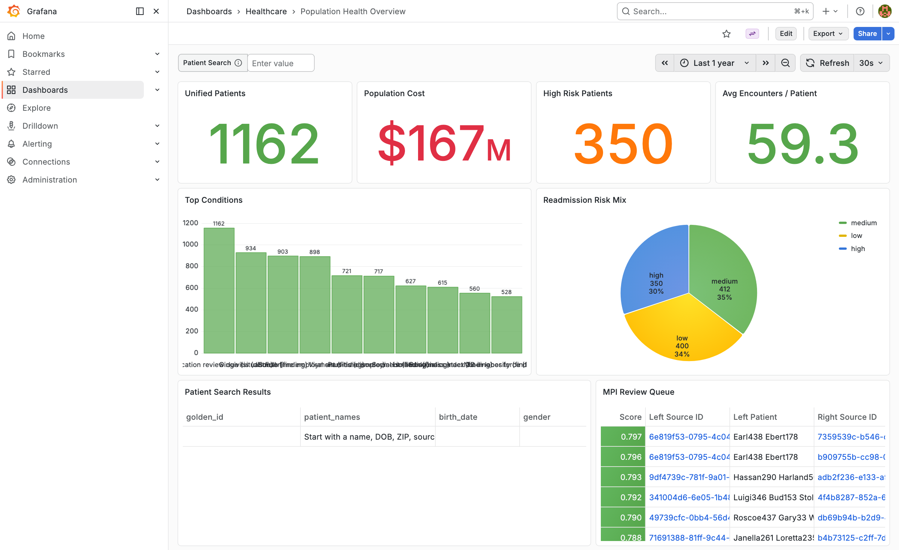
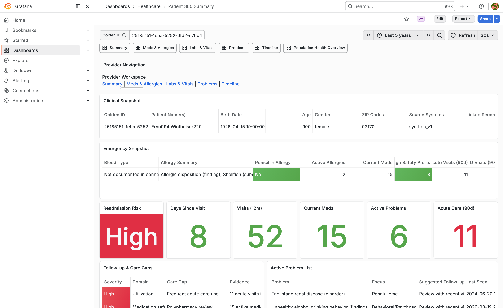
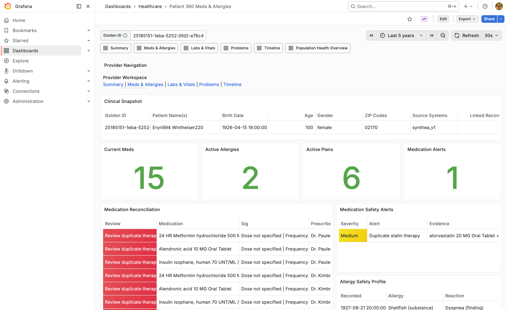
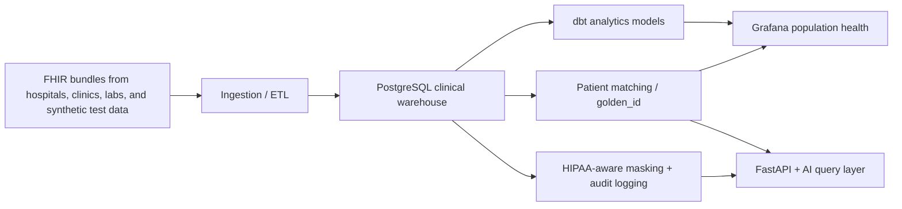

# Healthcare Data Platform

> One patient. One record. Safer care, cleaner operations, and governed healthcare AI.

[](https://www.python.org/)
[](https://fastapi.tiangolo.com/)
[](https://www.postgresql.org/)
[](https://www.hl7.org/fhir/)
[](https://www.getdbt.com/)
[](https://grafana.com/)
[](LICENSE)


Demo Video :- https://youtu.be/3etD7isIDGQ

This repository shows what a modern healthcare data product can look like when the entire workflow lives in one place:

- ingest fragmented FHIR data into a clean warehouse
- link duplicate patient identities into a unified record
- protect sensitive data with role-aware masking and audit logging
- give providers a patient-searchable 360 view
- power population health dashboards and governed AI queries

It is a strong MVP and product demo built on synthetic data. It is not presented as a certified production hospital system, but it is intentionally designed around real healthcare failure modes and the workflows that matter most.

## Product Tour

### Population Health Command Center



### Provider Workspace

| Patient 360 summary | Medication reconciliation and alerts |
|---|---|
|  |  |

## Why This Product Matters

Healthcare data breaks down at the exact moment teams need it most:

- the ER needs allergies, meds, and risk signals immediately
- claims teams need to know whether two records are actually the same person
- specialists need a unified timeline instead of fragmented snapshots
- compliance and analytics teams need governed access, not raw data sprawl

This platform is built to close those gaps with one connected pipeline instead of a collection of disconnected scripts.

## Three Real Scenarios This Platform Is Built For

### 1. Emergency care when the patient cannot speak for themselves

A patient arrives unconscious after visiting multiple hospitals in the past year. Their medication history, allergies, and recent encounters are scattered across different systems.

How the platform helps:

- records are unified under a `golden_id`
- the main dashboard supports direct patient search
- the provider workspace surfaces an emergency snapshot
- allergy and medication safety context appears quickly
- break-glass access is auditable

### 2. Duplicate identities that delay claims and operations

The same patient appears in multiple systems with slightly different names or demographics. Claims are delayed, care teams see duplicate charts, and downstream reporting becomes unreliable.

How the platform helps:

- probabilistic matching links source records to a shared `golden_id`
- `match_confidence` and `match_status` distinguish confirmed matches from review cases
- an MPI review queue gives operations teams a concrete list to resolve

### 3. Chronic care coordination across disconnected providers

A patient sees a PCP, a specialist, and an urgent care center. No one sees the full story, and the risk of missed follow-up or medication conflicts keeps rising.

How the platform helps:

- the patient 360 workspace consolidates visits, meds, labs, conditions, care plans, and reports
- medication reconciliation and safety alerts flag review needs
- population dashboards surface high-risk cohorts for proactive outreach
- governed AI queries make the warehouse easier to explore without exposing raw data broadly

## Why The Full Pipeline Is Useful

This repo is not just a dashboard and not just an ETL job. The value comes from the stages working together.

| Pipeline stage | Why it matters in the real world |
|---|---|
| FHIR ingestion | turns messy source bundles into a usable warehouse instead of leaving data trapped in raw JSON |
| Patient matching | creates one patient key across fragmented systems so analytics and care views stay trustworthy |
| Compliance layer | makes role-aware access and masking part of the product instead of an afterthought |
| dbt models | gives leaders and care managers population-level metrics they can actually act on |
| Provider dashboards | translates warehouse data into fast clinical review screens |
| AI query layer | lets approved users ask useful questions over safe views without direct raw-table access |

## Architecture



## What You Can Do With It Today

### Provider workflows

- search by `golden_id`, name, DOB, ZIP, or source identifier
- open a patient 360 summary focused on visits, risk, meds, allergies, care gaps, and acute utilization
- review medication reconciliation and safety alerts
- drill into labs, vitals, problems, and timeline views

### Population health and operations

- monitor unified patient counts, utilization, cost, and top conditions
- drill into high, medium, and low risk cohorts
- inspect MPI review candidates before duplicate records spread downstream

### Compliance and governed analytics

- mask sensitive data for non-provider roles
- log patient and query access
- constrain the AI layer to read-only SQL over safe views
- generate audit-friendly reporting inputs from a single warehouse

## Quick Start

### Prerequisites

- Python 3.11+
- Java 17+
- Git
- Docker Desktop, Colima, or another Docker-compatible runtime

### 1. Clone and install

```bash
git clone https://github.com/SaneethSunkari/healthcare-data-platform.git
cd healthcare-data-platform

python3 -m venv .venv
source .venv/bin/activate
pip install -r requirements.txt

cp .env.example .env
# set OPENAI_API_KEY in .env
```

### 2. Generate synthetic FHIR data

```bash
./ingestion/generate_synthea_data.sh
```

Optional custom patient volume:

```bash
./ingestion/generate_synthea_data.sh 500
```

### 3. Start PostgreSQL and Grafana

```bash
docker compose up -d
```

| Service | Address | Credentials |
|---|---|---|
| PostgreSQL | `127.0.0.1:15432` | `postgres / postgres` |
| Grafana | [http://localhost:3000](http://localhost:3000) | `admin / admin` |
| API | [http://127.0.0.1:8000](http://127.0.0.1:8000) | header-based role access |
| API docs | [http://127.0.0.1:8000/docs](http://127.0.0.1:8000/docs) | same API |

### 4. Load the warehouse and build analytics

```bash
python ingestion/fhir_parser.py --input-dir synthea/output/fhir
python matching/deduplicator.py
dbt run --project-dir analytics --profiles-dir analytics
dbt test --project-dir analytics --profiles-dir analytics
```

### 5. Run the API

```bash
uvicorn api.main:app --reload
```

### 6. Open the product

- Population dashboard: [http://localhost:3000/d/population-health-overview/population-health-overview](http://localhost:3000/d/population-health-overview/population-health-overview)
- Provider summary: [http://localhost:3000/d/patient-360-overview/patient-360-summary](http://localhost:3000/d/patient-360-overview/patient-360-summary)
- Meds and allergies: [http://localhost:3000/d/patient-360-medications/patient-360-meds-and-allergies](http://localhost:3000/d/patient-360-medications/patient-360-meds-and-allergies)
- API UI: [http://127.0.0.1:8000/ui](http://127.0.0.1:8000/ui)

## Example Questions To Ask

Operational and clinical questions that work well with the current stack:

- `How many unique patients do we have?`
- `What are the top 5 most common conditions?`
- `Which medications are prescribed most often?`
- `What is the average encounter cost by encounter type?`
- `How many patients were seen more than 3 times?`
- `Show high-risk patients with recent acute care use`

## Project Structure

```text
healthcare-data-platform/
├── ingestion/
│   ├── fhir_parser.py
│   └── generate_synthea_data.sh
├── matching/
│   └── deduplicator.py
├── compliance/
│   ├── pii_masker.py
│   └── generate_report.py
├── api/
│   ├── app/
│   ├── healthcare_prompt.py
│   ├── safe_views.sql
│   └── main.py
├── analytics/
│   ├── dbt_project.yml
│   ├── profiles.yml
│   └── models/
├── dashboard/
│   └── provisioning/
├── docs/
│   └── images/
├── synthea/
├── tests/
├── docker-compose.yml
├── schema.sql
├── requirements.txt
├── .env.example
└── README.md
```

## API Overview

### Query endpoints

| Method | Endpoint | Purpose |
|---|---|---|
| `POST` | `/query/ask` | natural language to SQL over safe analytics views |
| `POST` | `/query/run` | validated read-only SQL execution |
| `GET` | `/query/test-queries` | example questions to try |

### Patient endpoints

| Method | Endpoint | Purpose |
|---|---|---|
| `GET` | `/patients/search` | search unified patients |
| `GET` | `/patients/chart/{golden_id}` | provider patient chart |
| `GET` | `/patients/{patient_id}` | role-aware patient access |

### Schema and tool endpoints

| Method | Endpoint | Purpose |
|---|---|---|
| `POST` | `/schema/scan` | inspect the safe analytics schema |
| `GET` | `/tools/manifest` | function-style tool manifest |
| `POST` | `/tools/invoke` | programmatic tool execution |

## Data Model Highlights

| Table | Purpose |
|---|---|
| `patients` | source identities plus `golden_id`, match confidence, and match status |
| `encounters` | care events with dates, type, provider, and cost |
| `conditions` | coded clinical conditions tied to patients and encounters |
| `medications` | medication records plus status and reconciliation detail |
| `observations` | labs and vitals |
| `allergies` | allergies and reactions when present |
| `procedures` | procedures and interventions |
| `diagnostic_reports` | narrative and coded reports |
| `immunizations` | vaccination history |
| `care_plans` | care management plans |
| `audit_log` | patient and query access history |
| `patient_match_candidates` | MPI review queue for uncertain duplicates |

`golden_id` is the patient key to use when counting unique patients across systems.

## Security And Compliance

Implemented in the repo today:

- role-aware masking
- audit logging
- read-only SQL validation
- request IDs
- security headers
- trusted-host checks
- query timeouts and row caps
- optional shared-secret API protection for production-style deployments

Honest scope:

This repo demonstrates HIPAA-aware controls and safer healthcare access patterns, but it is still a portfolio-quality MVP built on synthetic data. It does not replace enterprise IAM, formal compliance programs, validated clinical decision support, or live EHR interoperability.

## Tests

Run the current automated checks with:

```bash
pytest tests
```

Current automated coverage includes:

- SQL safety validation
- security middleware behavior
- connection resolution defaults

## Environment Variables

Key settings from `.env.example`:

| Variable | Purpose |
|---|---|
| `OPENAI_API_KEY` | OpenAI key for AI-backed query endpoints |
| `OPENAI_MODEL` | model used by the NL-to-SQL layer |
| `DB_HOST` / `DB_PORT` / `DB_NAME` / `DB_USER` / `DB_PASSWORD` | PostgreSQL connection settings |
| `APP_ENV` | environment name such as `development` or `production` |
| `APP_API_KEY` | shared secret for protected API access |
| `REQUIRE_API_KEY` | enforce API key usage for protected routes |
| `CORS_ALLOW_ORIGINS` | allowed browser origins |
| `ALLOWED_HOSTS` | trusted hostnames |
| `QUERY_TIMEOUT_MS` | database statement timeout |
| `MAX_QUERY_ROWS` | maximum rows returned by query endpoints |

## What Would Move This Closer To Production

The next major steps would be:

- live EHR, payer, and lab integrations
- enterprise SSO and stronger IAM workflows
- database-level append-only audit enforcement
- clinically validated drug-interaction logic
- deployment automation, monitoring, and alerting
- broader automated coverage for ETL, masking, and matching correctness

## Author

Built by **Saneeth Sunkari**.

- LinkedIn: [https://www.linkedin.com/in/saneeth-sunkari-329391313](https://www.linkedin.com/in/saneeth-sunkari-329391313)
- Project 1: [https://github.com/SaneethSunkari/Ai-Business-Analyst](https://github.com/SaneethSunkari/Ai-Business-Analyst)

## License

MIT. See [LICENSE](LICENSE).
